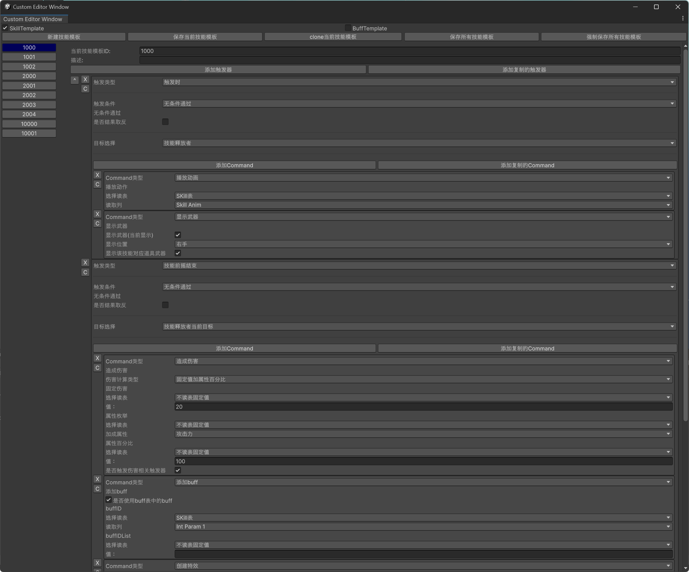

# zizouqi
一个基于GameFramework框架的单机自走棋demo
## 目录
- [zizouqi](#zizouqi)
  - [目录](#目录)
  - [技能编辑器](#技能编辑器)
## 技能编辑器
入口在”Window/技能编辑器“按钮

```csharp
public void OnTrigger(object arg = null)
{
    if (CurCondition != null && CurCondition.OnCheck(this,arg)==!CurCondition.ReverseResult)
    {
        if (CurTargetPicker != null)
        {
            CurTargetList = CurTargetPicker.GetTarget(this,arg);
        }
        if (CurCommandList != null && CurCommandList.Count != 0)
        {
            foreach (var oneCommand in CurCommandList)
            {
                oneCommand?.OnExecute(this,arg);
            }
        }
        if (CurTargetList != null)
        {
            ListPool<EntityBase>.Release(CurTargetList);
        }
    }
}